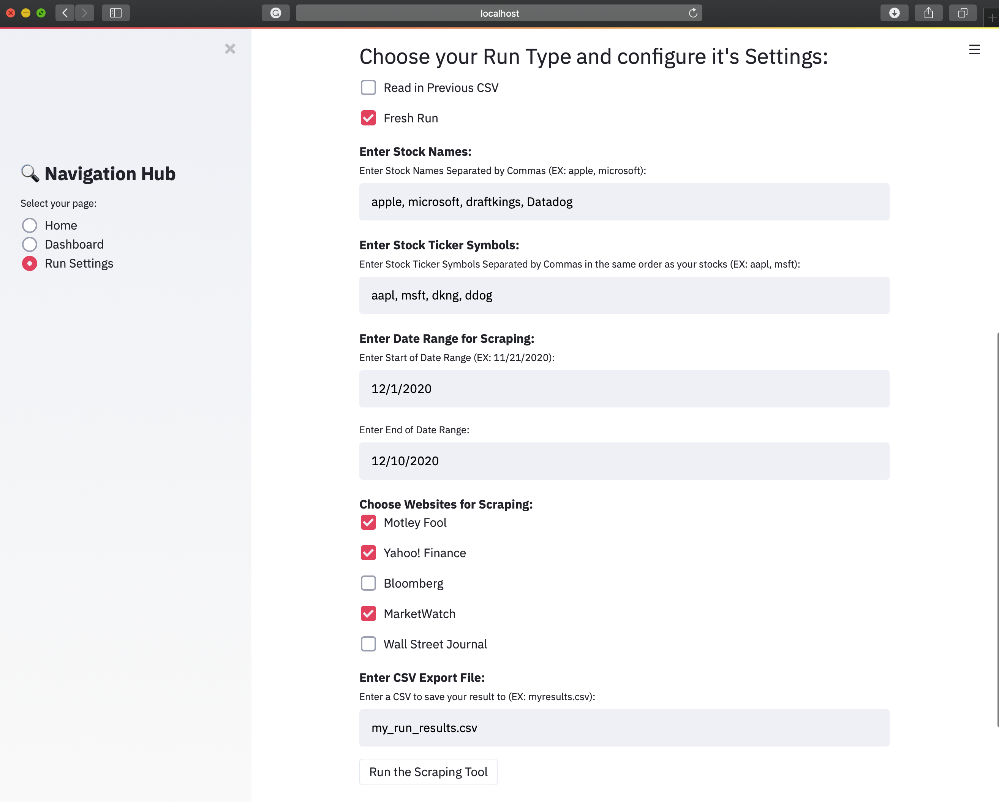

# StockStoryScraper [SSS]

Scrapes new articles from highly rated stock news websites thru Google News, analyzes them for sentiment among other things, then scores them and provides an overall rating of stock sentiment and well-being. Allows users to get a quick look into how a stock is performing in the news.

Fall 2020 Independent Study - Allegheny College.

## Tool Overview

- Scrapes articles from highly rated stock news websites specified by the user. The user also enters their chosen stocks, corresponding ticker symbols, date range for scraping, and an export file (`.csv`) that can be read back into the tool.
  - With this, users can read back in their previously exported CSVs of article information to view their results again.
    - Code to compare results from different runs will be added in future updates.
- Uses vaderSentiment to perform textual sentiment analysis.
- Scores the articles, gathers their price information, and generates results pertaining to the stocks overall sentiment feelings and well being.
- Tool is used via a User Interface (web application) using Streamlit or a Command Line Interface.
- More features to be added soon.

### What's the point?

It takes a lot of time to read every available news article about a stock, whether you are a professional trader or an amateur. The tool quickly gathers all the relevant articles from highly rated stock websites in the user's defined date range, then analyzes their textual sentiments. The user can read the articles that were scraped if they choose or look at the numerous graphs on the tool depicting article sentiments and overall stock feelings/performance.

This saves lots of time and gives users a one stop shop for stock news and the automatic analysis of them.

#### View the Program in Action

Here is an example of the projects web app UI (using Streamlit) in action. The example shows the settings being configured for a new, fresh run of the project:

## Running the Project

There are a few ways that users can run the project! These methods include using your own local Python3 installation, Pipenv, or Docker.

### Running with Docker

The program can be run within a Docker Container using Docker Desktop. For more information on how to install this program, view [this](https://www.docker.com/) resource.

There are builder scripts for each type of machine. First ensure you are in the `src` directory. To run the `Mac OS` version for instance, you would use the following commands:

1. `sh ./docker/build_macOS.sh` -- builds the container
2. `sh ./docker/run_macOS.sh` -- enters the container
3. `python3 run_tool.py` -- run the program

#### OS-specific scripts to build and run containers
The following bash scripts simplify building the container.

| OS  | Building  | Running  |
|---|---|---|
| MacOS  		|  `./build_macOS.sh` |  `./run_macOS.sh` |
| Linux   	|  `./build_linux.sh` | `./run_linux.sh`  |
| Windows 	|  `build_win.bat` 		|  `run_win.bat` |

These files may be found in the directory, `docker/` and the builder require a copy of `Dockerfile` to run which is in the `src` directory, hence why these command should be run from the `src` directory like in the example above.

### Running with Pipenv
Make sure Python(3) and Pipenv are installed on your machine. Find information on installing pipenv [here](https://pipenv-fork.readthedocs.io/en/latest/install.html).

#### Pipenv

The project comes with a `Pipfile` in the `src` directory that will install the necessary packages for the program, making it easy for users with Pipenv to run the project on their machines.

First navigate to the `src` directory using `cd src`. Then run the command `pipenv lock` to install the necessary Python packages.

You can then run the command `pipenv run python3 run_tool.py` to run the program. You will be presented with the option to run either the UI web interface or the Command Line Interface.

### Running with Python

First ensure Python and Pip are installed on your machine. Then navigate to the `src` directory.

You can install the required packages for the project using Pip by running `pip3 install -r requirements.txt` or `pip install -r requirements.txt` depending on your machine's Pip installation.

Then, you can run the program by using the command `python3 run_tool.py`.

*Note:* if you run into Spacy issues while running the program, you may have to run the command `python3 -m spacy download en`.

## Problems, Ideas, or Praise

Please leave an issue in the Issue Tracker if you encounter errors, have ideas, or anything of the like!

## Future Work

View the Issue Tracker to see future tasks that will be completed in the near future.
